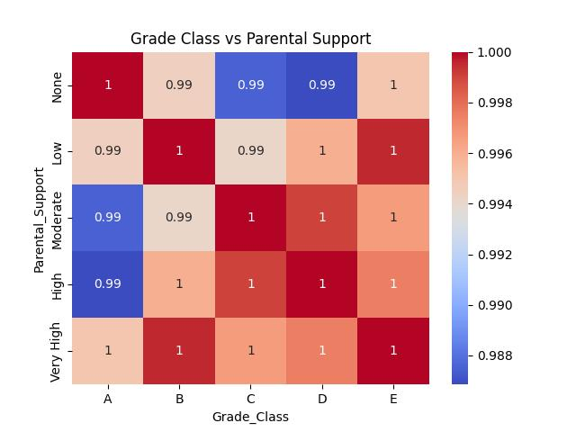

# 17-634 Applied Machine Learning Project: High School Student Academic Performance Prediction

## I. Problem statement
Many parents, especially asian parents care nothing more than the children’s academic performance. They are often willing to spend as much money as they can to ensure that their children achieve a 4.0 GPA. This project aims to develop a predictive model that identify high school students at risk of academic failure at an early stage. By doing so, it is possible to provide academic coaches, allowing parents to support their children more effectively and improve their overall academic outcomes.
  
This project utilizes the “Students Performance Dataset”, which contains 2392 records representing each students. The dataset comprises 15 columns, as potential features stored in a CSV file. These features include students’ student ID, age, gender, ethnicity, parental education, study time weekly, absences, tutoring, parental support, extracurricular, sports, music, volunteering, GPA, and grade class. The target column is “GPA”, which is in a range of 0 to 4.0.
  
## II. Feature egineering
The datatype and the examples are shown in the below table. StudentID is a unique identifier assigned to each student, from 1001 to 3392. It does not relate to academic performance. Age represents the students’ age, ranging from 15 to 18 years. The gender presents 0 as male and 1 as female. Ethnicity coded 0 as Caucasian, 1 as African American, 2 as Asian, and 3 as Other. ParentalEducation represents 0 as none, 1 as high school, 2 as some college, 3 as bachelor’s, and 4 as higher.
  
| Feature              | Examples                | Datatype                        |
|----------------------|------------------------|---------------------------------|
| Student ID          | 1001, 1002, 1003, …    | Numerical                       |
| Age                 | 15, 16, 17, 18         | Numerical / Ordered Categorical |
| Gender              | 0, 1                   | Categorical                     |
| Ethnicity           | 0, 1, 2, 3             | Categorical                     |
| Parental Education  | 0, 1, 2, 3, 4          | Numerical / Ordered Categorical |
| Study Time Weekly   | 19.8337228078547       | Numerical                       |
| Absences           | 0, 14, 26, …           | Numerical                       |
| Tutoring           | 0, 1                   | Categorical                     |
| Parental Support   | 0, 1, 2, 3, 4          | Numerical / Ordered Categorical |
| Extracurricular    | 0, 1                   | Categorical                     |
| Sports            | 0, 1                   | Categorical                     |
| Music             | 0, 1                   | Categorical                     |
| Volunteering      | 0, 1                   | Categorical                     |
| Grade Class       | 1.0, 2.0, 3.0, 4.0      | Numerical / Ordered Categorical |
  
StudyTimeWeekly represents weekly study time in hours, ranging from 0 to 20. Absences are the number of absences during the school year, ranging from 0 to 30. Tutoring represents tutoring status, where 0 is no and 1 is yes. ParentalSupport codes 0 as none, 1 as low, 2 as moderate, 3 as high, and 4 as very high. Extracurricular, Sports, Music, and Volunteering all represent participation in these items. They all use 0 as no and 1 as yes.
  
The dataset provider transformed many features to categorical numbers. For example, the class grade is transferred from letters to 2.0 to 4.0, and the parental education is transferred from strings like “high school” or “Bachelor’s” to a scale of 0 to 4. Therefore, further transformation or encoding is non necessary.
  
The Grade Class and the GPA are interchangeable, as they represent the same information in different formats. The mapping between Grade Class, Letter Grade, and GPA is shown in the table below:
  
| GradeClass | Letter Grade | GPA               |
|------------|-------------|-------------------|
| 0          | A           | GPA ≥ 3.5         |
| 1          | B           | 3.5 > GPA ≥ 3.0   |
| 2          | C           | 3.0 > GPA ≥ 2.5   |
| 3          | D           | 2.5 > GPA ≥ 2.0   |
| 4          | F           | 2.0 > GPA         |
  
By inspecting the Grade Class and GPA, it was observed that 169 rows contain contradictory values, where the Grade Class does not align with the corresponding GPA. These rows are removed from the dataset to ensure data consistency. Additionally, since using the grade class as a feature is relevant to using GPA to predict GPA, this column is also excluded from the feature set.
  
A linear regression is used to identify key features by gradually adding features and checking the R2 score. With the plot below, it is rational to say that the absence is an important feature in predicting GPA. Additionally, parental support also contributes slightly to the GPA.  

  
## III. Exploratory data analysis
The scatter plot below illustrates the relationship between weekly study time and GPA. The distribution of points suggests that there is no strong positive correlation between the two variables. Increased study time does not necessarily guarantee higher academic performance, nor does reduced study time always result in a low GPA.  
  
However, the lower density of points in the top-left and bottom-right corners indicates that studying more may reduce the likelihood of having a very low GPA, while studying less decreases the probability of achieving a high GPA. Given the lack of a strong correlation, it is reasonable to infer that other factors influence academic performance, with study time being just one of them.
  
The heat map below illustrates the relationship between parental support and GPA. The results indicate that parental support does not directly guarantee academic success. Students with high parental support may still experience academic failure, while those with little to no parental support can still achieve strong academic performance. However, this finding suggests only that parental support alone is not the solely determinant of academic performance. It is possible that parental support interacts with other factors.  

  
The following plot illustrates the number of absences across different grade classes. A Grade class of 0.0 corresponds to an “A”, while 4.0 represents an “F”. The green triangles indicate the mean number of absences for each grade category. The results suggest that students who achieved an “A” had significantly fewer absences compared to those with lower grades. However, having fewer than five absences does not necessarily guarantee better academic performance.  

  
The following box plot illustrates the weekly study time across different ages. The green triangles indicate the mean study time for each group. Based on the visualization, there is no significant difference in study time across different ages.  

  
The plot below illustrates the gender distribution within the dataset, showing that the number of male and female students is nearly equal. This balanced distribution allows for a comparative analysis of academic performance across genders.  

  
## IV. Modeling results
The data is randomly partitioned with a simple random sample method, allocating 80% for training, 10% for validation, and 10% for testing. This sampling technique ensures that each data point has an equal probability of being assigned to any subset. The model is trained using Random Forest, Decision Tree, and K-Nearest Neighbors. The results of these models are shown in the table below.
  
| Model           | Validation R2 | Validation MSE | Validation MAE | Test R2 | Test MSE | Test MAE |
|----------------|--------------|--------------|--------------|--------|--------|--------|
| Random Forest  | 0.91         | 0.06         | 0.20         | 0.93   | 0.06   | 0.20   |
| Decision Tree  | 0.87         | 0.11         | 0.27         | 0.87   | 0.12   | 0.27   |
| K-NN           | 0.90         | 0.07         | 0.21         | 0.91   | 0.09   | 0.24   |
  
Random Forest is recommended to address the problem. It performs the best in R2 scores among the three models. Additionally, the MSE and MAE are the lowest among the three models in validation and testing data. However, Random Forest has less transparency than Decision Tree and K-Nearest Neighbors.
  
## V. Deployment recommendations
Google Vertex AI and Docker is recommended to utilize in deployment. A Docker container ensures a stable and consistent environment, allowing the model to run identically across different systems. Compared to Virtual Machines (VMs), which are often resource-intensive, Docker containers are lightweight, consuming fewer resources and enabling faster deployment.
  
Google Vertex AI is part of Google Cloud Platform (GCP) that provides scalable deployment options, enabling the model to efficiently handle peak usage. As a Platform as a Service (PaaS), it allows for model management without the need to handle the underlying infrastructure, significantly reducing the time required for system setup and maintenance.
  
Additionally, GCP offers many tools to implement automated data processing on the cloud. Beyond deployment, Google Vertex AI provides automated alerts and logging to detect irregular events and monitor the model.
  
The security concerns include data leakage through a Google Cloud Storage (GCS) bucket, which is a storage system on GCP. If the bucket is set to publicly accessible, anyone with the correct bucket name can fetch files from it. The best way to prevent this is to keep the bucket private and restrict access using Identity and Access Management (IAM) policies.
  
Additionally, cloud-based APIs pose potential security risks since their internal operations are not always visible. It is possible for malicious individuals to steal the model and the data through the API. While it is difficult to fully prevent such attacks, monitoring abnormal network activity can help detect and respond to the threats.
  
After deployment, previously unnoticed factors may be found as contributing to the target. In such cases, it is recommended to collect sufficient data, containing those newly discovered factors as features, and retrain the model to improve its accuracy.
  
## VI. References
- [Rabie El Kharoua. (2024). 📚 Students Performance Dataset 📚 [Data set]. Kaggle.](https://doi.org/10.34740/KAGGLE/DS/5195702)
- Smith, A., Johnson, B., & Lee, C. (2022). Predicting students' performance in exams using machine learning techniques. Proceedings of the International Conference on Educational Data Mining, 123–130.
- Rizk, F. H., Saleh, A., Elgaml, A., Elsakaan, A., & Zaki, A. M. (2024). Exploring Predictive Models for Students' Performance in Exams: A Comparative Analysis of Regression Algorithms. Journal of Artificial Intelligence and Metaheuristics, 7(1), 38–52.
- Patel, D., & Wong, E. (2023). Analyzing the impact of socioeconomic factors on students' academic performance. Journal of Educational Research and Practice, 14(2), 45–58.
  